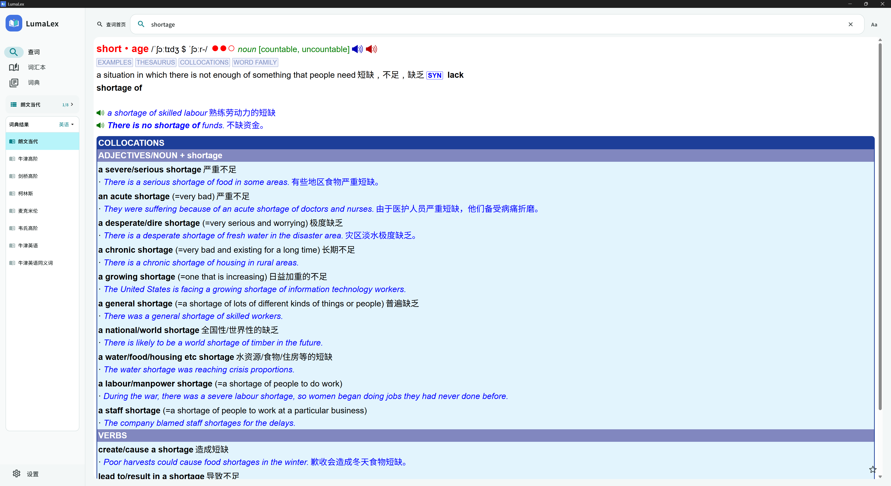
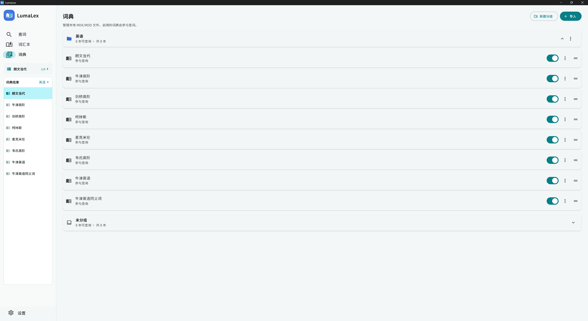
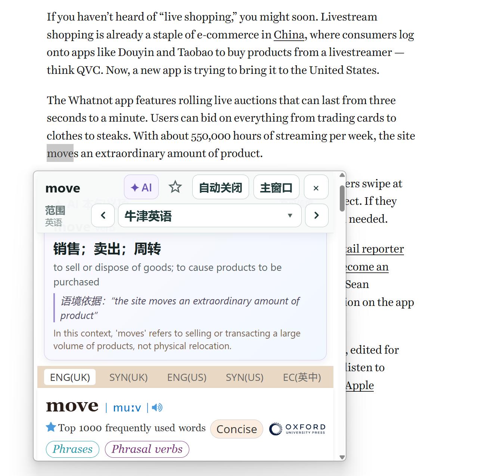
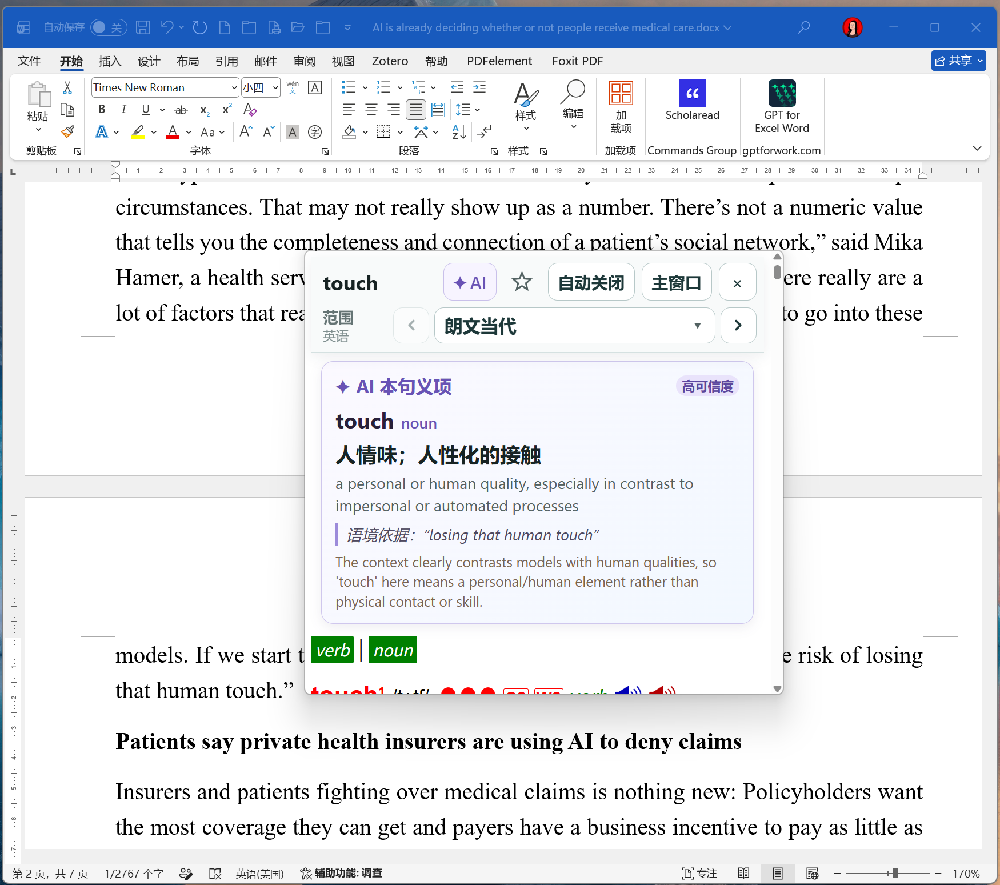

# LumaLex Windows

[简体中文](README.md) | [English](README_EN.md)

让离线词典留在本地，让查词融入阅读，让 AI 帮你判断单词在当前句子中的意思。

LumaLex 是面向 **Windows 10 / 11（64 位）** 的便携式 MDX/MDD 词典阅读器，由 Flutter 与 Rust 构建。本仓库只维护 Windows 电脑端，其他客户端版本由独立仓库维护。

LumaLex 不内置或分发商业词典，也不是必须联网才能使用的在线词典：导入自己的词典后即可离线查词；AI 语境释义是需要单独配置、主动触发的可选功能。

[下载 Windows 便携版](https://github.com/memetics1980/lumalex-windows/releases/latest) · [完整使用说明](docs/USER_GUIDE.zh-CN.md) · [English user guide](docs/USER_GUIDE.en.md) · [Windows 构建指南](app/windows/README.md)

点击截图可查看原尺寸图片。截图中的词典和阅读材料仅用于演示，不随程序分发；AI 截图是一次实际输出示例，不代表固定或保证正确的答案。

## 特色功能

### 离线词典与多词典对照

支持 MDX 词条和 MDD 图片、字体、音频等资源，尽量保留词典原有的排版与交互。导入词典文件夹后，词典原文件留在原位置，无需复制到应用目录。

[](docs/images/main-lookup.png)

主窗口查词：保留词典排版与发音控件，并通过左侧列表快速切换词典。

可以给词典分组，限定只在某个分组内查找和切换，也可以使用“全部词典”或“未分组”范围。下拉列表、左右箭头、快捷键和宽窗口左侧词典列表，让切换不再只有反复打开菜单一种方式。

[](docs/images/dictionary-groups.png)

词典管理：分组、启用状态、排列顺序及词典导入。

### 不离开阅读页面的取词浮窗

在其他应用中选中单词或短语，按下取词快捷键，即可在光标附近打开浮窗。浮窗提供：

- `[◀] [当前词典 ▾] [▶]` 切换控件，名称按钮打开可滚动的分组列表。
- 词条与例句发音；实际音频取决于导入词典的资源。
- 星形收藏按钮，收藏同步到主窗口的词汇本。
- “主窗口”按钮，将当前查词带回完整界面。
- 顶部空白区域拖动，支持鼠标或触摸，避免遮挡原文。
- “自动关闭”与“持续显示”：鼠标停在浮窗内不关闭，移出后 5 秒自动消失；持续显示模式不自动关闭。AI 请求进行中也不会因自动关闭而中断。

[](docs/images/screen-lookup-browser.png)

浏览器阅读示例：选中 moves，在同一浮窗中对照 AI 的本句释义与本地词典。

### AI 语境释义：找到“本句中的意思”

同一个词往往有多个义项。LumaLex 的 AI 功能把选中词和附近语境交给用户配置的模型，帮助判断当前句子中的词性与含义，而不是简单罗列所有释义。

例如，`voice` 在 “a beautiful voice” 与 “voice their concerns” 中的用法不同。这里仅用来说明语境分析的目的，不代表固定的 AI 输出。

分析结果包括词形、词性、中英文释义、语境依据，以及置信度和歧义提示。可以同时对照本地词典，核实 AI 的判断。

[](docs/images/ai-context-word.png)

Word 文档示例：AI 将 human touch 解释为“人情味、人性化的接触”。提供可用文本接口的文档应用也能取得语境，具体支持情况仍取决于应用。

**使用边界**：只有取到了可用的上下文才支持 AI 语境释义。部分 PDF 阅读器只能复制选中词，这时仍能查本地词典，但没有语境 AI。它不是 OCR，也不能保证读取所有应用。AI 结果可能出错，不应代替词典核查。

### 为 Windows 阅读习惯设计

- 支持窗口缩放、最大化、分屏和高 DPI 显示。
- 常用控件保留触摸友好的点击区域。
- 使用随应用附带的 Noto Sans SC UI 字体，并保留字体许可。
- 支持搜索历史、收藏、复习记录与学习数据导出/恢复。
- 可选择关闭主窗口时直接退出，或隐藏到系统托盘继续运行。

## 快速开始

1. 将 Windows 便携包完整解压到可写文件夹，运行 `LumaLex.exe`。不要只复制 EXE：DLL 和 `data` 目录必须保留在一起。
2. 在“词典”页面选择“导入词典”，导入包含 MDX 与配套 MDD 的文件夹。
3. 在“查词”页面输入单词，选择查找范围，并切换词典对照。
4. 在“设置 → 屏幕取词”启用全局快捷键，默认是 `Ctrl + Alt + L`；若冲突，可改选其他提供的组合。
5. 如需 AI，在“设置 → AI 语境释义”填写兼容 API 地址、模型名称和 API Key，保存并测试连接。选词打开浮窗后，主动点击 AI 按钮。

详细配置、浮窗操作、PDF 限制和故障排查见[使用说明](docs/USER_GUIDE.zh-CN.md)。

## 数据与隐私

- 本地词典查词不需要调用 AI；词典文件不会因为启用 AI 而整本上传。
- API Key 保存在当前 Windows 用户的安全凭据中。点击浮窗 AI 按钮时，会向配置的服务发送选中词和最多约 500 个字符的附近语境；“测试连接”也会发送一条示例请求。
- 不要对包含隐私或保密内容的文本使用外部 AI；服务商的数据处理与计费规则由服务商决定。
- 不兼容应用的复制模式会更新系统剪贴板；密码输入框不会取词。
- 设置和学习记录存放在 Windows 用户应用数据目录中。“便携版”指程序免安装，不代表用户数据都存放在程序文件夹。
- 学习数据导出包含历史、收藏、复习进度和阅读字号，不包含 MDX/MDD、词典库或 AI API Key。换电脑时需另外准备词典并重新配置 AI。

## 开发与构建

需要 Windows 10/11 x64、启用 Windows 桌面的 Flutter stable、Visual Studio 2022 的“使用 C++ 的桌面开发”组件，以及 Rust stable 的 `x86_64-pc-windows-msvc` 目标。运行词条页面需要 Microsoft Edge WebView2 Runtime。

请保留完整仓库和 `app/pubspec.yaml` 引用的本地依赖。从仓库根目录运行：

```powershell
cd app
flutter pub get
.\windows\build_portable.ps1
```

脚本运行 Flutter 测试并生成便携 ZIP 与 SHA-256 校验文件，输出到 `app/windows/releases`。这些构建产物不作为源码提交。已发布的便携包请从 [Releases](https://github.com/memetics1980/lumalex-windows/releases/latest) 下载，不要把 GitHub 的源码 ZIP 当作可运行程序。

开发运行与测试：

```powershell
cargo test -p dictionary-core
cd app
flutter pub get
flutter test
flutter run -d windows
```

[应用开发说明](app/README.md) · [Windows 开发与发布指南](app/docs/PLATFORM_MANAGEMENT.md)

## 仓库结构与许可边界

```text
docs/                      中英文使用说明
app/lib/                   界面与应用服务
app/windows/               Windows 原生集成与打包
app/test/                  Flutter 测试
app/rust_builder/          Flutter / Rust 构建桥接
crates/dictionary-core/    MDX/MDD 引擎
crates/dictionary-bridge/  Flutter / Rust API 桥接
vendor/mdictlib/           修补后的词典解析器
```

工具链、编译缓存、便携包、词典数据与敏感配置不提交到仓库。请保留第三方依赖和字体的许可文件。拥有词典文件不代表拥有再分发权，使用与分享前应核实授权。
