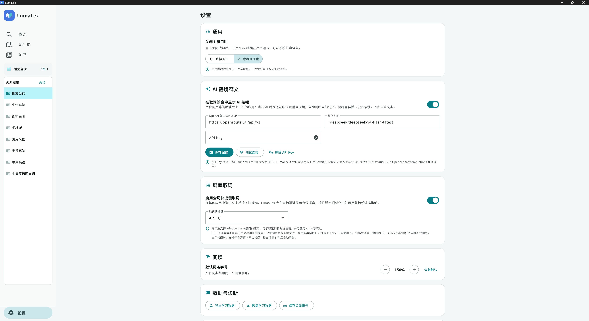
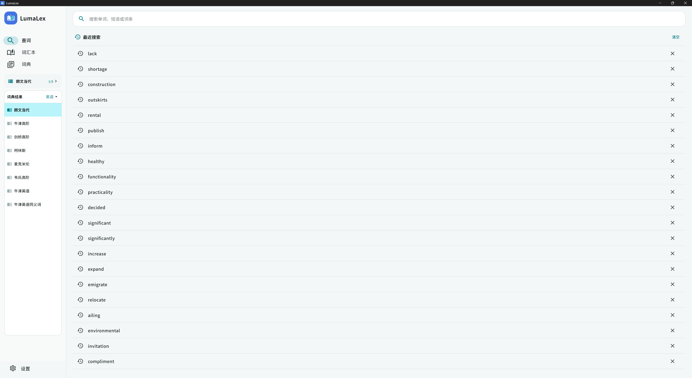

# LumaLex Windows user guide

[简体中文](USER_GUIDE.zh-CN.md) | [English](USER_GUIDE.en.md) · [Project overview](../README_EN.md)

For macOS, start with the [installation, permissions and popup guide](MACOS_GUIDE.en.md). Dictionary management and learning features are shared, while installation, permissions and global shortcuts differ.

This guide covers the portable 64-bit Windows 10/11 edition. Bring your own legitimately obtained MDX/MDD dictionaries. AI is optional assistance, not a replacement for offline dictionaries. Chinese UI labels are included below to help locate controls; this documentation does not change the application's interface language.

Click screenshots to view the full-resolution originals. The displayed dictionaries and reading materials are not bundled with the application.

## 1. First launch and dictionary import

1. Extract the complete portable package and run `LumaLex.exe`. Keep its DLLs and `data` folder beside it.
2. If dictionary pages are blank, confirm that Microsoft Edge WebView2 Runtime is installed.
3. Open the dictionary page (词典), click Import dictionary (导入词典), and select the dictionary folder.
4. Keep the MDX and matching MDD files together, for example:

```text
MyDictionary/
  MyDictionary.mdx
  MyDictionary.mdd
  MyDictionary.1.mdd
  MyDictionary.2.mdd
```

MDX contains entries; MDD contains resources such as audio, images and fonts. Keep any accompanying CSS/JS files and the complete dictionary folder. Missing resources can leave text readable but images or pronunciation unavailable.

Do not move, rename or delete the source files after import. Initial import or source changes may require indexing. Reimport if the location changes. LumaLex does not modify the original MDX/MDD files.

## 2. Main-window lookup and dictionary groups

Enter a word or phrase on the lookup page (查词) and submit it. The original query is tried across the current scope before any related form. If it is absent, a bounded local fallback preserves the original text and shows a persistent explanation: for example, `coughed up` may match `cough up`. An existing `exciting` entry takes priority; `-ing` and `-ed` alone do not determine part of speech. If only `excite` is found, it is labeled as a related form, not a claim about the original word's meaning in context.

Even when the original has its own entry, locally verified related forms appear as optional buttons in both the main window and the popup. For example, `suckling` keeps its noun entry by default while offering `suckle`; switch only by clicking Original (原词) or Related base form (相关原形). Candidates must exist in the current dictionary scope. Rules alone cannot determine the meaning used in the sentence.

The popup shows only form-switching buttons and a brief hint. The longer original-selection/related-form explanation is removed entirely, rather than retained in a collapsible section, to preserve reading space.

Explicitly choosing a form also changes the current query. Switching from `suckling` to `suckle` updates the popup title or main search field; favorites save `suckle` and its displayed entry's gloss, and Open main window also queries `suckle`. Click Original to switch back. Each form has its own favorite status. Merely offering an automatic related-form fallback, before an explicit choice, still preserves the original query.

For contextual disambiguation, explicitly request AI in a popup that has nearby context. If AI suggests a different lemma and an exact entry exists within the current scope, a View entry (AI suggestion) button appears. AI never automatically switches the dictionary entry or sends a request during ordinary lookup. Form switching preserves the original selection and sentence as AI context, while favorites use the currently chosen query.

When a phrase has no independent entry but a headword candidate exists, View headword (查看主词) displays its definition and changes the current query to that headword only after a click; a word definition is not a phrase definition. Spelling corrections remain labeled. Morphological fallback runs offline without automatically calling AI. Popup AI receives the original selection and sentence.

[](images/main-lookup.png)

A styled dictionary entry and the desktop dictionary sidebar.

On the dictionary page, set display names, enabled status, order and groups. Choose all dictionaries (全部词典), ungrouped dictionaries (未分组), or a specific group for lookup. A specific group restricts both lookup and previous/next switching; it does not automatically continue into another group.

[](images/dictionary-groups.png)

Create groups, enable dictionaries, adjust their order or import another folder.

Ways to switch:

- Click the dictionary name to open the selection list.
- Use the previous/next arrow buttons within the current scope.
- Use the left dictionary list in wide windows, or expand it from its entry point when compact.
- Press `Ctrl + PageUp` / `Ctrl + PageDown` in the main window for the previous/next dictionary.

Follow dictionary entry links to look up related words. After selecting text in an entry, the right-click Copy (复制) and Look up (查词) actions copy the selection or start another lookup. Speaker buttons play recorded audio only when the dictionary includes the corresponding resources.

### Main-window shortcuts

| Shortcut | Action |
| --- | --- |
| `Ctrl + L` | Focus the search field |
| `Ctrl + D` | Toggle the current entry's favorite status |
| `Ctrl + ← / →` | Move backward / forward through entry navigation history |
| `Ctrl + PageUp / PageDown` | Switch to the previous / next dictionary |
| `Esc` | Dismiss transient UI; exact behavior depends on focus |

Entry-history navigation is different from switching dictionaries. Shortcut handling may depend on the focused control or dictionary page.

## 3. Screen lookup: open a popup while reading

### Enable and use

1. Open Settings → Screen lookup (设置 → 屏幕取词), and enable global shortcut lookup (启用全局快捷键取词).
2. The default is `Ctrl + Alt + L`. The settings also offer `Ctrl + Shift + L` and `Alt + Q`.
3. Leave LumaLex running and select a word or phrase in another application.
4. Press the shortcut to open the lookup popup near the pointer.

On Windows, click Custom shortcut (自定义快捷键…), press a combination in the recording area, then select Use this shortcut (使用此快捷键). Use Ctrl or Alt with a letter, digit or F1–F11, optionally adding Shift. Win, F12, unmodified keys and common copy/paste/editing combinations are excluded. Global lookup pauses while recording and resumes on cancellation. Saved shortcuts persist across restarts. macOS supports custom Command/Option combinations with optional Shift; both platforms share the same release version.

When lookup is enabled, changing the shortcut checks availability and preserves the original on a conflict. When lookup is disabled, you may save first; availability is checked when enabling it. Fully exiting LumaLex disables global lookup. To keep it running in the background, select the hide-to-tray close behavior.

### Popup controls

- **Switch dictionaries**: use `[◀] [Current dictionary ▾] [▶]`. Clicking the name opens a scrollable grouped menu for choosing the scope and dictionary. Arrows stay within that scope.
- **Favorite**: click the star to save or unsave the word. The main vocabulary page shares the same records.
- **Pronunciation**: click a speaker in the entry to play the dictionary's audio.
- **Main window (主窗口)**: continue the current word lookup in the full interface.
- **Move**: drag the empty top area with a mouse or touch. Buttons and entry text are not drag surfaces.
- **Automatic closing (自动关闭)**: the popup stays open while the pointer is inside and disappears five seconds after it leaves. Return the pointer to continue reading.
- **Persistent display (持续显示)**: toggle the display-mode button to disable automatic closing. Close manually or switch back to automatic mode.
- **Waiting for AI**: an active AI request pauses automatic closing. You can still close the window manually.

[](images/screen-lookup-browser.png)

The popup combines scope selection, dictionary arrows, favorites, display mode and optional AI output.

### Application compatibility

| Reading environment | Capture method | Contextual AI |
| --- | --- | --- |
| Ordinary webpages or apps exposing usable Windows text interfaces | Reads the selection and attempts to capture nearby context | Available when configured and context is usable |
| Some PDF readers and incompatible apps | Compatibility copy mode; selected text only | Unavailable without context |
| Scanned images or copy-protected documents | Text capture may fail; this is not OCR | Unavailable |
| Password fields | Excluded from capture | Unavailable |

Browser PDFs and different document readers do not all behave alike. Document structure, permissions and text-interface support matter. Compatibility copy mode is a normal fallback for dictionary lookup, and it updates the system clipboard.

## 4. Contextual AI explanations

### Why use it?

Traditional dictionaries list multiple senses for the reader to distinguish. AI uses the current sentence to suggest a more targeted interpretation while leaving the local dictionary available for comparison.

Results include the lemma, part of speech, English and Chinese meanings, source evidence, a confidence level and an ambiguity note. Confidence is the model's own judgment, not a calibrated accuracy score. Check short contexts and complex sentences especially carefully.

[](images/ai-context-word.png)

An example analysis of “human touch” in Word. This is one model response, not a guaranteed interpretation for every context or application.

### Configure the service

Open Settings → Contextual AI (设置 → AI 语境释义):

1. Enable Show AI button in the lookup popup (在取词浮窗中显示 AI 按钮).
2. Enter your provider's **OpenAI-compatible API address**. A base URL such as `https://example.com/v1` is usually appropriate; LumaLex appends `/chat/completions` and also accepts the full endpoint. This is a format example, not a working service.
3. Enter the provider's **model ID**, not its marketing name.
4. Enter your **API key** and click Save configuration (保存配置). It is stored in the current Windows user's secure credentials.
5. Click Test connection (测试连接) to verify that the service returns the required structured explanation.

[](images/settings.png)

The screenshot shows example service, model and shortcut choices, not required defaults or recommendations. The API key is not displayed.

Remote services require HTTPS. A local service may use an HTTP localhost or 127.0.0.1 address, but must still meet the application's endpoint, model and key requirements.

Select a word in an application that provides context, press the lookup shortcut, and click AI in the popup. Enabling the feature or opening the popup does not automatically analyze the context. Testing the connection actively sends a sample request.

### Limits and privacy

- Copy fallback has no context and cannot offer contextual AI. Check the capture mode before troubleshooting AI settings.
- Clicking AI sends the selected word and up to approximately 500 characters of nearby context, not whole dictionaries or documents.
- External AI requires a reachable service and may incur provider-determined fees. Offline dictionary lookup does not depend on AI being enabled.
- Do not send private information, confidential work or text you are not authorized to share with the provider.
- AI can misidentify a sense, part of speech or supporting evidence. Check the original sentence and reliable dictionaries rather than treating its response as fact.
- Disable AI when not needed. The settings also let you delete the stored API key.

## 5. Favorites, reading settings and the tray

The main window and popup share favorites. Open the vocabulary page (词汇本) to view saved words and related learning records.

The lookup home page also lists recent searches; click an item to look it up again.

[](images/search-history.png)

Search history provides quick access to previously looked-up words.

Use `Aa` on the lookup page or Settings → Reading (设置 → 阅读) to adjust text scale across dictionaries. A scale change reflows the entry.

Settings → When closing the main window (设置 → 关闭主窗口时) offers Exit directly (直接退出) or Hide to tray (隐藏到托盘). Hiding keeps the app running and allows restoration from the system tray. Right-click the tray icon to exit completely. Screen lookup requires the app to remain running.

## 6. Backup and moving to another computer

Open Settings → Data and diagnostics (设置 → 数据与诊断) and choose Export learning data (导出学习数据) or Restore learning data (恢复学习数据).

- Exports contain history, favorites, review progress and reading text scale.
- They do not include dictionary files, library configuration or AI API keys.
- Restore replaces current learning records with the backup. Export your current data first. Dictionary files and the library are unaffected.
- On another computer, separately prepare your licensed dictionary files, reimport them, and configure AI and the lookup shortcut again.

The portable package requires no installation, but preferences and learning records live in the Windows user's application-data directory. Copying the program folder alone does not migrate all personal data.

## 7. Troubleshooting

- **Blank entry**: check WebView2 Runtime, unchanged dictionary paths, and complete MDX/MDD and accompanying resources.
- **Word not found**: inspect the captured text, lookup scope, and whether the dictionary is enabled and accessible. Try typing the word manually.
- **Screen lookup cannot be enabled**: choose another offered shortcut and confirm that the app and tray are running normally.
- **PDF capture fails**: try copying manually in the reader first. Scans or documents that block copying may not support current text capture; use manual lookup.
- **No AI button**: confirm that the toggle and configuration are saved. Selected text without context in copy mode cannot offer contextual AI.
- **AI timeout or errors**: check the network, API address, model ID, key and service allowance. Some compatible endpoints or models do not return the expected format.
- **No pronunciation**: check the matching MDD resources, system volume and output device. Not every dictionary includes recorded audio.
- **Reporting a problem**: save a diagnostic report from Data and diagnostics. Review it for private paths or details before sharing; do not include API keys or dictionaries you cannot redistribute.

[Project overview](../README_EN.md) · [简体中文](USER_GUIDE.zh-CN.md)
